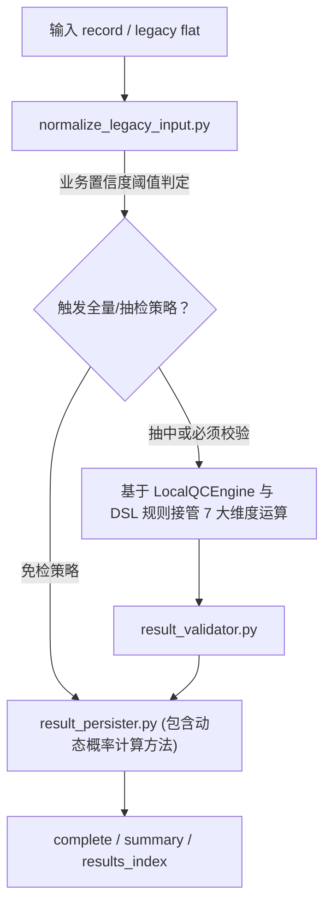

# BigPoi-verification-qc

## 1. 技能定位

`BigPoi-verification-qc` 负责对上游 BigPOI 核验结果做质量复核，产出可落盘、可回库的 QC 结果。

它支持 canonical 输入，也兼容 legacy flat 输入，并通过归一化脚本收敛到统一 QC 判定模型。

## 2. 输入与输出

### 2.1 输入

- canonical 输入：`schema/qc_input.schema.json`
- legacy flat 输入：`schema/qc_legacy_flat_input.schema.json`
- 归一化脚本：`scripts/normalize_legacy_input.py`

典型输入包含：

- 基础记录信息：`task_id`、名称、地址、经纬度、行政区划、类别
- 上游核验信息：`upstream_decision`
- 证据数据：`evidence_data`

### 2.2 输出

- `.complete.json`：完整 QC 结果
- `.summary.json`：摘要结果
- `results_index.json`：结果索引

## 3. 核心维度

当前 QC 规则围绕以下维度展开：

- `existence`
- `name`
- `location`
- `address`
- `administrative`
- `category`
- `downgrade_consistency`

## 4. 关键资源

| 路径 | 说明 |
|---|---|
| `rules/decision_tables.json` | QC DSL 主规则 |
| `schema/decision_tables.schema.json` | DSL schema |
| `config/scoring_policy.json` | 评分策略 |
| `scripts/dsl_validator.py` | DSL 校验 |
| `scripts/result_validator.py` | 结果校验 |
| `scripts/result_persister.py` | QC 结果落盘 |

## 5. 推荐流程

## 6. 适用场景

- 需要校验上游核验结果是否可直接通过
- 需要识别风险维度和人工复核要求
- 需要把 QC 结果输出为统一 JSON 结构并交由回库技能处理

## 7. 维护要求

- 调整 QC 规则时优先更新 `rules/decision_tables.json` 与本 README。
- 调整输入兼容范围时同步更新两个 schema 与归一化逻辑说明。
- 新增输出字段或结果索引结构时同步更新 CHANGELOG。

