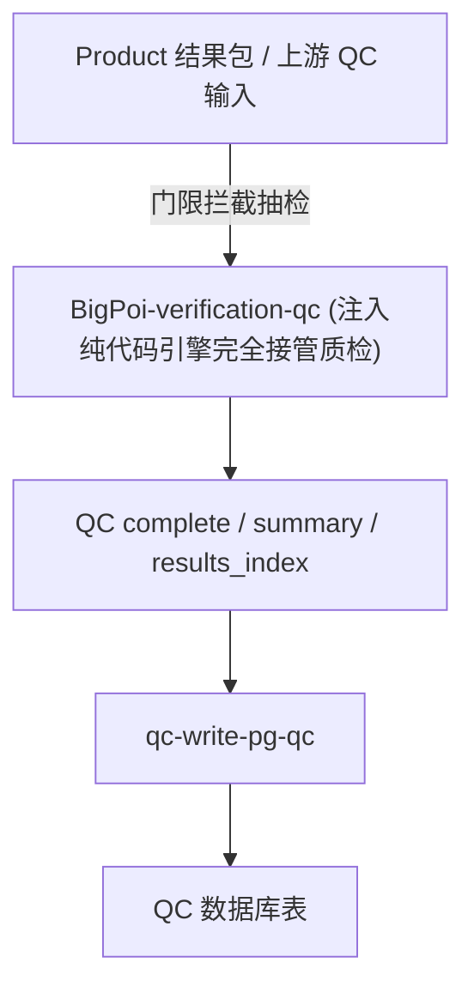

# Quality 域文档

## 1. 域定位

`Quality/` 负责 BigPOI 核验结果的质量复核链路，面向 QC 判定、风险识别、质量结果持久化与回库。

## 2. 模块组成

| 模块 | 作用 |
|---|---|
| `BigPoi-verification-qc/` | QC 主技能，负责输入归一化、维度判定、结果校验与落盘 |
| `qc-write-pg-qc/` | QC 结果回库技能，负责把 `.complete.json` 写回 PostgreSQL |

## 3. 主流程

## 4. 关键目录

| 路径 | 说明 |
|---|---|
| `BigPoi-verification-qc/rules/` | QC DSL、规则说明、检查清单 |
| `BigPoi-verification-qc/schema/` | QC 输入、结果、summary、索引 schema |
| `BigPoi-verification-qc/scripts/` | 归一化、DSL 校验、结果校验、结果持久化脚本 |
| `qc-write-pg-qc/config/db_config.yaml` | QC 回库数据库配置 |
| `qc-write-pg-qc/scripts/` | QC 回库数据转换、加载、写库脚本 |

## 5. 维护要求

- 规则、schema、输出结构变更时，先更新 `BigPoi-verification-qc` 的 README / CHANGELOG。
- 回库字段、表结构、输入方式变更时，先更新 `qc-write-pg-qc` 的 README / CHANGELOG。
- 涉及 `BigPoi-verification-qc/rules/README.md` 等规则文档的调整时，也要同步检查本文件中的域级入口描述。
- 域级流程发生变化时，同时更新本文件和 `Quality/CHANGELOG.md`。
