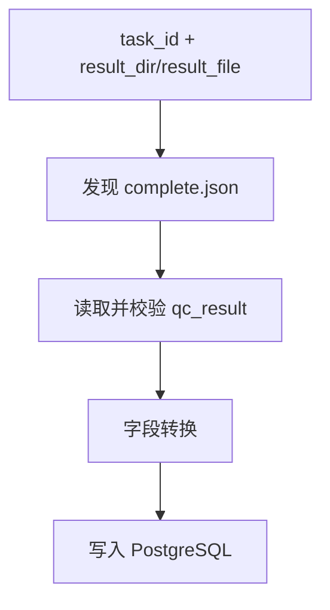

# qc-write-pg-qc

## 1. 技能定位

`qc-write-pg-qc` 负责把 QC 结果目录中的 `.complete.json` 解析后写回 PostgreSQL 质量表。

它是 `BigPoi-verification-qc` 的下游回库技能，重点解决三件事：

- 定位正确的 QC 结果文件
- 校验结果结构是否满足回库要求
- 将字段映射到目标表并写入数据库

## 2. 输入方式

支持两种输入模式：

### 2.1 `task_id + result_dir`

适用于只知道任务编号和结果根目录的场景。技能会在 `result_dir` 下定位 `{task_id}` 目录，并优先通过 `results_index.json` 找到 `.complete.json`。

### 2.2 `task_id + result_file`

适用于已经明确知道 `.complete.json` 文件路径的场景，可直接跳过索引发现步骤。

## 3. 关键目录

| 路径 | 说明 |
|---|---|
| `SKILL.py` | Python 入口 |
| `config/db_config.yaml` | 数据库连接配置 |
| `scripts/file_loader.py` | 结果文件加载 |
| `scripts/data_converter.py` | QC 结果到数据库字段的转换 |
| `scripts/db_writer.py` | 数据库写入 |

## 4. 推荐流程

## 5. 输入约束

- `task_id` 必填。
- `result_file` 与 `result_dir` 至少提供一个。
- 如果使用 `result_dir`，目录下应存在该任务的 `results_index.json` 或可唯一定位的 `.complete.json`。
- 默认目标表为 `poi_qc_zk`，如脚本支持可按配置切换到其他表。

## 6. 输出与返回

回库完成后，通常返回：

- 任务标识
- 目标表名
- 写入状态
- 关键统计信息或错误信息

## 7. 维护要求

- 表结构变化时同步更新 `scripts/data_converter.py` 与本 README。
- 结果发现逻辑变化时同步更新索引解析说明。
- 新增字段映射、默认表名或错误处理策略时同步更新 CHANGELOG。

