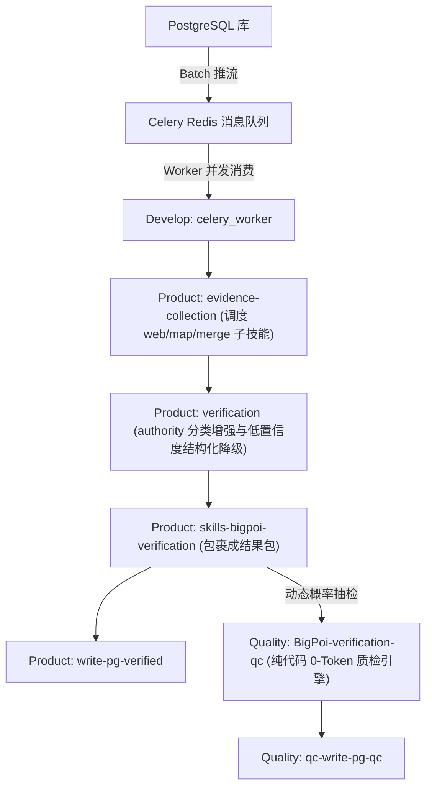

# BigPOI Verification Workspace

## 1. 项目概览

本仓库按 `Product / Quality` 双域组织 BigPOI 核验相关技能。

- `Product/` 负责正式核验链路，包括证据收集、核验决策、结果打包与回库。
- `Quality/` 负责 QC 质量复核链路，包括 QC 判定、结果持久化与回库。

仓库目标是把 POI 从原始输入推进到可落库、可追溯、可复核的结构化结果，并通过 README / CHANGELOG 维护各层入口文档。

## 2. 目录结构

| 路径 | 说明 |
|---|---|
| `Develop/` | 调度与并发网关域，包含 Celery 的 Task 生产及 Worker 分发 |
| `Product/` | 生产核验域，面向正式 BigPOI 核验结果 |
| `Quality/` | 质量复核域，面向 QC 规则判定与回库 |
| `docs/backups/` | 文档备份目录，保存更新前的 README / CHANGELOG 快照 |
| `.claude/` | Claude Code 本地技能工作目录 |

## 3. 域划分

### 3.1 Develop

负责全系统的异步驱动与容灾分发：

- `generate-batch/`
- `worker/`

### 3.2 Product

包含 7 个核心技能：

- `skills-bigpoi-verification/`
- `evidence-collection/`
- `evidence-collection-web/`
- `evidence-collection-map/`
- `evidence-collection-merge/`
- `verification/`
- `write-pg-verified/`

### 3.3 Quality

包含 2 个核心技能：

- `BigPoi-verification-qc/`
- `qc-write-pg-qc/`

## 4. 推荐异步并发流程

## 5. 文档维护约定

- 工作区级文档放在仓库根目录，描述整体结构、域划分与协作方式。
- 域级文档放在 `Product/` 与 `Quality/`，描述该域职责、技能关系和主流程。
- 技能级文档放在各技能目录，描述输入输出、脚本入口、配置与落地产物。
- 规则级文档放在各规则目录下的 `README.md`，用于说明具体维度、判定口径和规则资源。
- 更新文档前先备份到 `docs/backups/<timestamp>/`。

## 6. 协作建议

- Product 侧新增脚本、schema、配置时，先更新 `Product/README.md` 与 `Product/CHANGELOG.md`。
- Quality 侧新增规则、schema、回库字段时，先更新 `Quality/README.md` 与对应技能文档。
- 涉及跨域流程变更时，同时更新本文件和受影响域的 CHANGELOG。

## 7. 当前 Product 主线（2026-04-07）

- `evidence-collection` 是 Product 侧唯一正式证据收集入口，内部再编排 `evidence-collection-web`、`evidence-collection-map` 与 `evidence-collection-merge` 三个子技能。
- `evidence-collection/scripts/run_evidence_collection.py` 作为证据收集主脚本，负责并行 worker 调度、分支结果读取与 merge 落盘。
- `evidence-collection/scripts/run_parallel_claude_agents.py` 参考 `Develop/row-batch/scripts/run_claude.py`，通过两个 `claude -p` worker 并发执行 web 与图商分支。
- web 分支优先使用模型内置 `WebSearch / WebFetch`；仅在当前运行环境不可用时，才回退到内部代理 Python 脚本。
- Product web 证据配置已收敛为“配置源默认只负责 search discovery 与来源权重”，门户类 URL 不再自动进入 `webreader` 直读。
- `web-branch-result.json` 现在会额外暴露 `webreader_execution_state` 与 `attention_required`，用于区分“详情页已读但无有效信息”和“详情页链路没有执行完整”。
- Product merge 会对同源重复网页证据去重，verification / bundle validator 会额外拦截 accepted 结果里未收敛的粗粒度地址。
- Product 图商内部代理默认采用“10 秒首超时 + 60 秒单次重试”的策略；第二次仍超时会直接抛异常，方便正式环境显式暴露代理故障。
- `claude -p` 调用日志统一落到 `output/results/{task_id}/claude-agent-logs/`，便于和正式结果目录一起排障留档。
- review seed 默认由并行 worker 写入 `output/runs/{run_id}/process/`，legacy 编排脚本已支持自动发现，无需强制手动传参。
- 政府机关行政层级口径已统一：`130105` 覆盖乡镇与街道，`130106` 仅覆盖社区/行政村等乡镇以下级。
- Product 技能工程化定稿方案见 [docs/Product_skill_engineering_finalization_plan_20260407.md](/Users/liubai/Documents/project/ft_project/datamalo/big_poi/docs/Product_skill_engineering_finalization_plan_20260407.md)。
