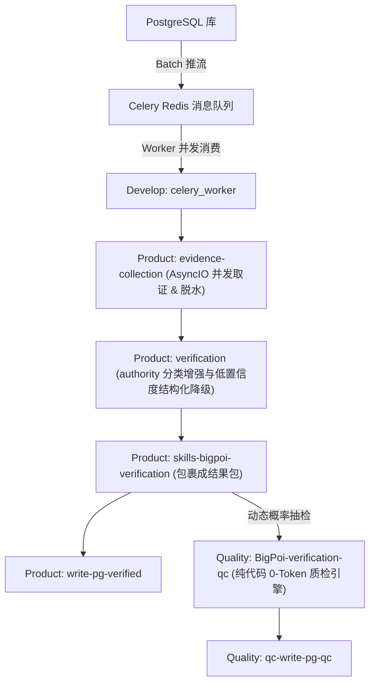

# BigPOI Verification Workspace

## 1. 项目概览

本仓库按 `Product / Quality` 双域组织 BigPOI 核验相关技能。

- `Product/` 负责正式核验链路，包括证据采集、核验决策、结果打包与回库。
- `Quality/` 负责 QC 质量复核链路，包括 QC 判定、结果持久化与回库。

仓库目标是把 POI 从原始输入推进到可落库、可追溯、可复核的结构化结果，并通过 README / CHANGELOG 维护各层入口文档。

## 2. 目录结构

| 路径 | 说明 |
|---|---|
| `Develop/` | 调度与并发网关域，包含 Celery 的 Task 生产及 Worker 分发 |
| `Product/` | 生产核验域，面向正式 BigPOI 核验结果 |
| `Quality/` | 质量复核域，面向 QC 规则判定与回库 |
| `docs/backups/` | 文档备份目录，保存更新前的 README / CHANGELOG 快照 |
| `.claude/` | Claude Code 本地技能工作目录 |

## 3. 域划分

### 3.1 Develop
负责全系统的异步驱动与容灾分发：
- `generate-batch/`
- `worker/`

### 3.2 Product

包含 4 个核心技能：

- `skills-bigpoi-verification/`
- `evidence-collection/`
- `verification/`
- `write-pg-verified/`

### 3.2 Quality

包含 2 个核心技能：

- `BigPoi-verification-qc/`
- `qc-write-pg-qc/`

## 4. 推荐异步并发流程

## 5. 文档维护约定

- 工作区级文档放在仓库根目录，描述整体结构、域划分与协作方式。
- 域级文档放在 `Product/` 与 `Quality/`，描述该域职责、技能关系和主流程。
- 技能级文档放在各技能目录，描述输入输出、脚本入口、配置与落地产物。
- 规则级文档放在各规则目录下的 `README.md`，用于说明具体维度、判定口径和规则资源。
- 更新文档前先备份到 `docs/backups/<timestamp>/`。

## 6. 协作建议

- Product 侧新增脚本、schema、配置时，先更新 `Product/README.md` 与 `Product/CHANGELOG.md`。
- Quality 侧新增规则、schema、回库字段时，先更新 `Quality/README.md` 与对应技能文档。
- 涉及跨域流程变更时，同时更新本文件和受影响域的 CHANGELOG。

## 7. 最近迭代提醒（2026-04-01）

- Product `evidence-collection` 已新增内部搜索代理适配层，`websearch` 默认执行 `baidu -> tavily` 回退策略。
- Product `verification` 已移除低置信度硬中断，authority 场景改为正式输出 `manual_review / downgraded`。
- Product `evidence-collection` 已进入二期主控收敛，新增统一 orchestrator 程序化调度证据收集链路。
