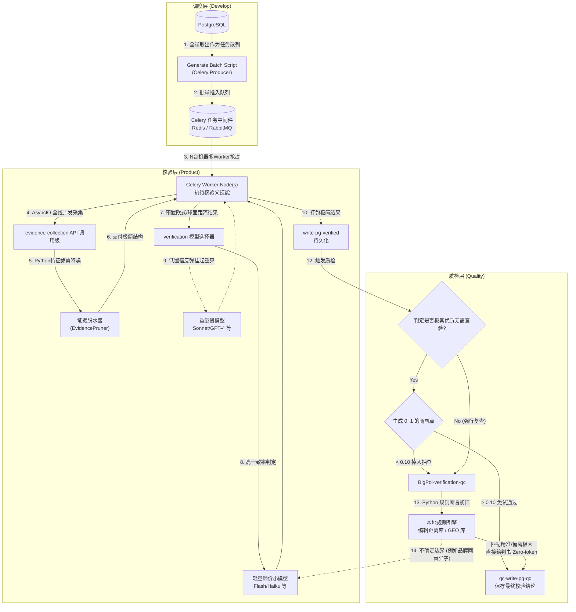

# 大 POI 核实项目：工程化落地实施方案 v2.0

本方案旨在将“并发、异步、缓存、本地规则化去大模型”的架构理念转化为**精确到代码及模块**的具体动作。可以直接当作技术排期卡和开发规范执行。

## Proposed Changes

以下是详细的代码维度改造点列表（按核心域划分）。

---

### 1. 调度层：由推式脚本转为异步并发队列
**目标**：打破目前 [generate_batch.py](file:///d:/project/bigpoi-verification-v1.1.0/Develop/generate-batch/scripts/generate_batch.py) 的单机串行执行瓶颈。

#### [MODIFY] [Develop/generate-batch/scripts/generate_batch.py](file:///d:/project/bigpoi-verification-v1.1.0/Develop/generate-batch/scripts/generate_batch.py)
- **改造内容**：剥离原本直接“插入后等待大单体跑完”的封闭循环。
- **技术选型**：引入 `Celery` + `Redis` 作为任务中间件。
- **实施细节**：
  1. 保留原有 [BatchGenerator](file:///d:/project/bigpoi-verification-v1.1.0/Develop/generate-batch/scripts/generate_batch.py#60-469) 解析规则和 SQL 检索的功能。
  2. 取出 `input_table` 的每一行 POI 数据（或按 100 条聚合），通过 `celery_app.send_task("run_verification", args=[row_data])` 散列到 Redis 队列。
  3. 将脚本改造为一个单纯的 **Producer（生产者）**，本身极速返回运行结束。

#### [NEW] `Develop/worker/celery_worker.py` (新增模块)
- **改造内容**：搭建多个并行监听的 Worker 节点。
- **实施细节**：
  1. 监听 `run_verification` 任务，拿到 POI 参数后，调用原来 `skills-bigpoi-verification` 中的 [init_run_context.py](file:///d:/project/bigpoi-verification-v1.1.0/Product/skills-bigpoi-verification/scripts/init_run_context.py) 开始实际核验流程。
  2. 可用 `Supervisor` 或是 `PM2` 甚至 K8S 起多实例，真正实现**横向并发扩展**。

---

### 2. 取证核实层：网络并发化与 Token 数据脱水
**目标**：解决各个 API 串行耗时极高的问题，以及原生 API JSON 塞入大模型导致的 Token 灾难。

#### [MODIFY] [Product/evidence-collection/scripts/evidence_collection_common.py](file:///d:/project/bigpoi-verification-v1.1.0/Product/evidence-collection/scripts/evidence_collection_common.py)
- **改造点 A（AsyncIO 并行取证）**：
  - **现状**：代码中遍历并挂起等待不同图商和搜索引擎。
  - **落地**：引入 `aiohttp` 与 `asyncio`。将 `call_map_vendor()`、`call_internal_proxy()` 全部改为 `async def`。使用 `asyncio.gather(*tasks)` 一次性并发发出所有外网 HTTP 请求，等待的总时间收敛至“最慢的一次请求”时长。为保证数据的时效核实能力，此环节将不做证据缓存处理，每次任务均发起全新并行采集。

#### [MODIFY] [Product/evidence-collection/scripts/write_evidence_output.py](file:///d:/project/bigpoi-verification-v1.1.0/Product/evidence-collection/scripts/write_evidence_output.py)
- **改造点 B（证据“脱水”压缩）**：
  - **落地**：新增 `EvidencePruner` 类。大模型不需要图商 API 返回的深层包裹结构（如 HTTP status, debug_messages, HTML tag 杂质）。在此脚本将证据写入 `evidence_*.json` 给下阶段前，过滤出单纯的 `["name", "location", "address", "telephone", "poi_type", "status"]` 核心字面量，组装极简缩进 JSON 格式，平均压缩体积约 80%。

#### [MODIFY] [Product/verification/scripts/write_decision_output.py](file:///d:/project/bigpoi-verification-v1.1.0/Product/verification/scripts/write_decision_output.py)
- **改造点 C（大模型计算前置化与路由）**：
  - **落地**：
    1. **空间地理预处理**：在组装送给模型的 Prompts 前，利用 Python 原生包 `geopy.distance` 或者自定义 Haversine 公式，自动计算 `input.location` 和所有 `evidence[].location` 之间的物理直线距离。在传入 Prompt 时，直接显式插入文本：`"地理计算结果：高德证据距离该点 42.5 米"`。强制剥离大模型的数学和幻觉漏洞。
    2. **大模型 Fallback 路由**：调用模型库接口时，默认传入轻快模型（如 `Claude-3-Haiku` / `GPT-4o-mini`）。如果返回的结果中的总体信心度 `confidence < 85` 或有任一维度出现冲突 `uncertain`，在 Python 层直接拦截，把这单的 prompt 抛给原有的重型模型（如 `Claude-3.5-Sonnet`）复议重答。

---

### 3. 质检层：去 LLM 全代码规则化
**目标**：绝大部分判断都存在边界，这部分全交由纯代码来阻挡，达成 Token 指数级的成本下降和时间毫秒级的压缩。

#### [MODIFY] [Quality/BigPoi-verification-qc/scripts/dsl_validator.py](file:///d:/project/bigpoi-verification-v1.1.0/Quality/BigPoi-verification-qc/scripts/dsl_validator.py) 及相关判定主轴
- **改造内容**：将基于提示词大模型判定的流转变更为“100% 规则引擎”直接输出结论。
- **实施细节**：
  1. **构建纯 Python 判定树**：在 Python 侧加载 `decision_tables.json`。
  2. **Existence 截停**：统计有效 evidence 个数。个数 < 1 直接判定 `fail`，无需任何 NLP。
  3. **Location（核实中心逻辑）**：使用 `geopy.distance` 读取源经纬度和核实验证经纬度，若 `< 500m` （基于 config 读取）直接通过；`> 1000m` 认定越界 `fail`。
  4. **Name / Address**：引入 `Levenshtein` 编辑距离库以及 `jieba` 分词比对。当文本相似度字面计算 `>= 85%`，直接定性为 `pass`。
  5. 仅当比对相似度处于 `50% ~ 85%` 的死角或出现规则引擎无法判定的强歧义描述，才组装一条极小的 Prompt，抛给底层的 LLM 执行单项裁决。确保 90% 以上的数据“零 LLM 质检”。

#### [MODIFY] [Quality/BigPoi-verification-qc/scripts/result_persister.py](file:///d:/project/bigpoi-verification-v1.1.0/Quality/BigPoi-verification-qc/scripts/result_persister.py)
- **改造内容**：动态比例抽样 (Sampling)。
- **实施细节**：在触发质检前，在父技能与该脚本相交处的入口：
  1. 判断上游 `write_decision` 带来的 confidence。
  2. 若 `upstream.confidence == 1.0` 且所有修改提议皆为正常（无 Downgrade），走 `random.random() < 0.1`（即 10% 概率）。如果不中签，不执行任何质检，直接向表里落入“免检合格”并在 `is_auto_approvable` 等中打标签。

---

## 改造前后架构对比图

---

## Verification Plan

### Automated / Code-level Tests
1. **网络并发 IO 断言**：针对 [evidence_collection_common.py](file:///d:/project/bigpoi-verification-v1.1.0/Product/evidence-collection/scripts/evidence_collection_common.py) 各爬虫和三方图商组件，编写 pytest 进行断点阻挡，打印耗时并强制确认为 `max(耗时_A, 耗时_B)` 级别而非 sum。
2. **纯真度裁剪测试 (De-hydration)**：抓取 2 个最长的商圈原始 HTML 与 高德全量 JSON，通过 `EvidencePruner` 落库后的 token 计数器计算，应验证比之前减少不低于 70%。
3. **质检抽离测试**：写一段 python 脚本抛出 100 条典型的完全通过和彻底偏离的用例送给修改后的本地规则引擎 [dsl_validator.py](file:///d:/project/bigpoi-verification-v1.1.0/Quality/BigPoi-verification-qc/scripts/dsl_validator.py)，用时应小于 2 秒且不再发起任何向外层的网络连接（即 `0 LLM Call` 命中）。
