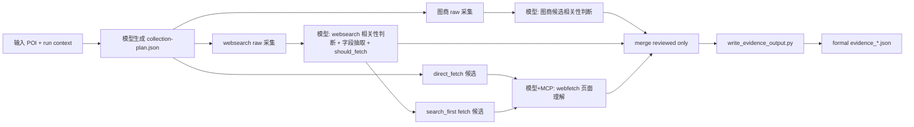

# Product 二期详细设计：计划驱动的 Evidence Collection Skill 架构

## 1. 文档目标

本文档用于把 `Product` 域证据收集链路的二期方案细化到可开发程度，覆盖：

- 顶层 skill 编排方式
- 三条分支的节点划分
- 原始文件、review 文件、正式 evidence 的 contract
- 模型节点与脚本节点的职责边界
- 新增脚本、提示词、schema、目录结构
- 开发阶段、测试方案与验收标准

本文档是对以下二期规划文档的详细展开：

- [Product_phase2_engineering_plan_evidence_collection_unification_20260401.md](/Users/liubai/Documents/project/ft_project/datamalo/big_poi/docs/Product_phase2_engineering_plan_evidence_collection_unification_20260401.md)

## 2. 设计结论

### 2.1 最终结论

证据收集二期不应再以“单个 Python 主控脚本从 raw 一路跑到 `evidence_*.json`”作为正式主线。

推荐架构为：

1. 顶层由 skill / 大模型生成结构化执行计划 `collection-plan.json`
2. 计划中显式区分 `script` 节点与 `model` 节点
3. Python 脚本只负责确定性工作：
   - 原始采集
   - 参数校验
   - 中间结果结构化落盘
   - reviewed 结果校验
   - 归并
   - 正式 evidence 写盘
4. 大模型只负责语义工作：
   - 图商候选相关性判断
   - `websearch` 结果相关性判断与字段抽取
   - `webfetch` 页面理解与字段抽取
5. `merge` 只允许读取 reviewed 文件，不允许 raw 直接进入正式 evidence

### 2.2 为什么不能继续走“纯 Python 一把梭”

当前问题已经说明，纯 Python 主控如果没有把模型 review 作为正式阶段纳入流程，就会天然出现以下问题：

- `websearch` 原始结果非结构化，标题和摘要杂乱无章，纯规则抽取 `name/address/category` 容易严重失真
- 图商候选如果未经过模型相关性判断，错误候选会直接进入 formal evidence
- `webfetch` 本身必须依赖模型与 MCP，因此顶层不可能是纯 Python
- formal evidence 的正确性要求高于 raw 采集结果的可用性，必须存在 reviewed gate

因此，二期的核心不是“让 Python 更强”，而是“把模型 review 阶段正式纳入主流程”。

## 3. 设计原则

### 3.1 顶层编排原则

- 顶层编排由 skill 完成，而不是由单个 Python 独吞全流程
- skill 通过一个结构化计划文件驱动后续节点执行
- 计划文件中只能使用预定义节点，不允许模型自由发明脚本、参数或路径

### 3.2 结果产出原则

- raw 文件永远不是正式 evidence
- reviewed 文件永远是过程文件
- formal evidence 只能由 reviewed 结果归并后生成
- 大模型不直接写 `evidence_*.json`

### 3.3 边界原则

- 模型负责语义判断
- 脚本负责结构正确性与落盘
- `merge` 负责多源整合
- `write_evidence_output.py` 只负责 formal evidence contract，不负责语义判断

### 3.4 与 Claude Skills 规范的对齐

本方案遵循 Claude Skills 文档中的几个关键点：

- `SKILL.md` 负责主说明与导航
- 复杂 skill 应将提示词模板、schema、脚本作为支持文件放在 skill 目录中
- 顶层 skill 应保持为可编排的 prompt-based workflow，而不是把所有细节都硬塞进 `SKILL.md`
- 可通过 frontmatter 和支持文件控制 skill 的调用方式、支持文件加载方式与脚本调用方式

参考：

- [Claude Skills 文档](https://code.claude.com/docs/zh-CN/skills)

## 4. 总体架构



## 5. 目标目录结构

建议保持 `Product/evidence-collection/` 为唯一正式主线目录，并在其下补充支持文件：

```text
Product/evidence-collection/
├── SKILL.md
├── config/
├── prompts/
│   ├── generate_collection_plan.md
│   ├── map_relevance_review.md
│   ├── websearch_review_extract.md
│   └── webfetch_extract.md
├── schemas/
│   ├── collection_plan.schema.json
│   ├── map_review_seed.schema.json
│   ├── websearch_review_seed.schema.json
│   └── webfetch_review_seed.schema.json
└── scripts/
    ├── build_web_source_plan.py
    ├── call_internal_proxy.py
    ├── call_map_vendor.py
    ├── websearch_adapter.py
    ├── prepare_map_review_input.py
    ├── write_map_relevance_review.py
    ├── prepare_websearch_review_input.py
    ├── write_websearch_review.py
    ├── build_webfetch_plan.py
    ├── write_webfetch_review.py
    ├── merge_evidence_collection_outputs.py
    └── write_evidence_output.py
```

## 6. 过程文件分层

### 6.1 文件分层定义

二期后，所有过程文件必须明确分为四层：

1. `plan`
2. `raw`
3. `reviewed`
4. `formal`

### 6.2 路径建议

所有过程文件仍落在：

- `output/runs/{run_id}/process/`

formal evidence 仍落在：

- `output/runs/{run_id}/staging/evidence_<timestamp>.json`

### 6.3 文件命名约定

建议统一如下：

- `collection-plan.json`
- `map-raw-internal-proxy.json`
- `map-raw-fallback-{vendor}.json`
- `map-review-input-{branch}.json`
- `map-review-seed-{branch}.json`
- `map-reviewed-{branch}.json`
- `websearch-raw.json`
- `websearch-review-input.json`
- `websearch-review-seed.json`
- `websearch-reviewed.json`
- `webfetch-plan.json`
- `webfetch-review-seed.json`
- `webfetch-reviewed.json`
- `collector-merged.json`
- `evidence_<timestamp>.json`

## 7. 顶层计划文件设计

### 7.1 设计目的

`collection-plan.json` 是整个二期架构的关键中枢。

它由顶层 skill 结合输入 POI 生成，用来描述：

- 本次要走哪些节点
- 每个节点是脚本节点还是模型节点
- 每个节点的输入文件、输出文件、参数与前后依赖
- 哪些 raw 结果需要进入 review
- 哪些 `websearch` 命中需要进入 `webfetch`

### 7.2 顶层字段

建议结构如下：

```json
{
  "plan_id": "COLLECT_20260401_xxx",
  "poi_id": "123456",
  "task_id": "task_xxx",
  "run_id": "run_xxx",
  "created_at": "2026-04-01T10:00:00Z",
  "node_registry_version": "v1",
  "plan_summary": "本次采集采用图商 + websearch + webfetch 三分支，图商需补采 bmap，websearch reviewed 后再决定 search_first fetch。",
  "nodes": []
}
```

### 7.3 节点类型

建议只允许三种节点类型：

- `script`
- `model`
- `gate`

说明：

- `script`：执行固定 Python 脚本
- `model`：执行一个固定模板的模型任务
- `gate`：执行确定性判断，如是否补采、是否进入 `webfetch`

### 7.4 节点结构

建议统一字段：

```json
{
  "id": "websearch_review",
  "type": "model",
  "tool": "websearch_review_extract",
  "inputs": {
    "raw_path": "output/runs/{run_id}/process/websearch-review-input.json"
  },
  "outputs": {
    "review_seed_path": "output/runs/{run_id}/process/websearch-review-seed.json"
  },
  "depends_on": ["websearch_prepare_review_input"],
  "on_success": ["write_websearch_review"],
  "on_failure": "stop"
}
```

### 7.5 计划约束

- `tool` 只能来自预定义 registry
- 输出路径必须在 `output/runs/{run_id}/process/` 或 `staging/`
- 节点不能引用未声明依赖的文件
- `merge` 节点的输入必须全部是 reviewed 文件
- formal evidence 节点只能出现在最后阶段

## 8. 节点注册表

### 8.1 script 节点注册表

建议登记如下：

| 节点 tool | 脚本 | 职责 |
|---|---|---|
| `build_web_source_plan` | `build_web_source_plan.py` | 生成 web 来源计划 |
| `call_internal_proxy` | `call_internal_proxy.py` | 拉取内部图商代理原始结果 |
| `call_map_vendor` | `call_map_vendor.py` | 缺失图商补采 |
| `websearch_adapter` | `websearch_adapter.py` | 通过内部搜索代理生成 `websearch-raw.json` |
| `prepare_map_review_input` | `prepare_map_review_input.py` | 将图商 raw 转为模型 review 输入卡片 |
| `write_map_relevance_review` | `write_map_relevance_review.py` | 根据模型 seed 输出 `map-reviewed-*.json` |
| `prepare_websearch_review_input` | `prepare_websearch_review_input.py` | 将 `websearch-raw.json` 转为 review 输入 |
| `write_websearch_review` | `write_websearch_review.py` | 根据模型 seed 输出 `websearch-reviewed.json` |
| `build_webfetch_plan` | `build_webfetch_plan.py` | 生成 webfetch 目标列表 |
| `write_webfetch_review` | `write_webfetch_review.py` | 根据模型 seed 输出 `webfetch-reviewed.json` |
| `merge_evidence_collection_outputs` | `merge_evidence_collection_outputs.py` | 只归并 reviewed 文件 |
| `write_evidence_output` | `write_evidence_output.py` | 输出 formal evidence |

### 8.2 model 节点注册表

建议登记如下：

| 节点 tool | 提示词模板 | 职责 |
|---|---|---|
| `generate_collection_plan` | `prompts/generate_collection_plan.md` | 生成结构化执行计划 |
| `map_relevance_review` | `prompts/map_relevance_review.md` | 判断图商候选是否与输入 POI 相关 |
| `websearch_review_extract` | `prompts/websearch_review_extract.md` | 判断 `websearch` 结果相关性并抽取结构化字段 |
| `webfetch_extract` | `prompts/webfetch_extract.md` | 结合 MCP 抓取页面并抽取结构化字段 |

### 8.3 gate 节点注册表

建议登记如下：

| 节点 tool | 职责 |
|---|---|
| `check_missing_map_vendors` | 根据内部代理结果判断是否补采 |
| `select_fetch_targets` | 根据 `websearch-reviewed` 中 `should_fetch=true` 生成 fetch 候选 |
| `validate_reviewed_inputs` | 校验 reviewed 文件是否齐全 |

## 9. 三条分支详细流程

### 9.1 图商线

#### 9.1.1 目标

- 采集图商候选
- 对候选进行快速相关性判断
- 只把相关候选推进到 reviewed 文件

#### 9.1.2 流程

1. `call_internal_proxy.py` -> `map-raw-internal-proxy.json`
2. `check_missing_map_vendors` gate
3. 对缺失源执行 `call_map_vendor.py` -> `map-raw-fallback-{vendor}.json`
4. `prepare_map_review_input.py`
5. 模型节点 `map_relevance_review` 输出 `map-review-seed-{branch}.json`
6. `write_map_relevance_review.py` 输出 `map-reviewed-{branch}.json`

#### 9.1.3 模型输入最小字段

建议输入卡片字段：

- `candidate_key`
- `vendor`
- `name`
- `address`
- `vendor_category`
- `coordinates`
- `computed_distance_meters`
- `city`
- `poi_name`
- `poi_address`

#### 9.1.4 模型输出最小字段

```json
{
  "vendors": {
    "amap": {
      "candidate_decisions": [
        {
          "candidate_key": "xxx",
          "is_relevant": true,
          "reason": "名称高度一致，地址位于同一区域"
        }
      ]
    }
  }
}
```

### 9.2 websearch 线

#### 9.2.1 目标

- 调用内部搜索代理获取非结构化结果
- 对结果做语义相关性判断
- 抽取受控结构化字段
- 直接形成可归并的 `websearch-reviewed.json`
- 标记哪些结果需要进入 `webfetch`
- 在 `webfetch` 不可用或执行失败时，仍可作为正式 evidence 的有效来源继续下游流程

#### 9.2.2 流程

1. `build_web_source_plan.py` -> `web-plan.json`
2. `websearch_adapter.py` -> `websearch-raw.json`
3. `prepare_websearch_review_input.py`
4. 模型节点 `websearch_review_extract` 输出 `websearch-review-seed.json`
5. `write_websearch_review.py` -> `websearch-reviewed.json`
6. `select_fetch_targets` gate -> `webfetch-plan.json`

#### 9.2.3 为什么必须有 review 阶段

`websearch` 原始结果通常包含：

- 标题
- 摘要
- URL
- 发布时间

这些信息本质上是半结构化文本，不能稳定直接映射为 formal evidence。

因此 review 阶段必须完成：

- 是否与当前 POI 相关
- 该结果来源属于官网 / 政务页 / 新闻 / 百科 / 论坛 / 其他
- 能否提取可靠的 `name / address / category / phone / email / level_hint`
- 是否已具备“无需 `webfetch` 也可直接归并”的结构化充分性
- 是否值得进入 `webfetch`

#### 9.2.4 模型输出最小字段

```json
{
  "items": [
    {
      "result_id": "WEB_001",
      "is_relevant": true,
      "confidence": 0.86,
      "reason": "标题和摘要均指向目标政府机关",
      "source_type": "official",
      "extracted": {
        "name": "XX市人民政府",
        "address": "XX路1号",
        "category_hint": "地市级政府",
        "phone": null,
        "email": null
      },
      "evidence_ready": true,
      "should_fetch": true,
      "fetch_url": "https://xx.gov.cn/..."
    }
  ]
}
```

### 9.3 webfetch 线

#### 9.3.1 目标

- 对官网或高价值页面做页面级理解
- 提取 `websearch` 无法稳定拿到的关键字段
- 作为增强层补全字段与提升置信度，而不是 formal evidence 的唯一前置条件

#### 9.3.2 流程

1. `build_webfetch_plan.py`
2. 模型节点 `webfetch_extract`
3. `write_webfetch_review.py` -> `webfetch-reviewed.json`

#### 9.3.3 fetch 来源

包括两类：

- `direct_fetch`：来自配置源、输入 POI 官网等明确站点
- `search_first`：来自 `websearch-reviewed.json` 中 `should_fetch=true` 的结果

说明：

- `webfetch` 的目标是“补强”，不是“替代” `websearch-reviewed`
- 即使 `webfetch` 整体失败，只要 `websearch-reviewed.json` 已形成结构化有效结果，主流程仍应继续 merge 和 formal evidence 写出
- 只有当 `websearch-reviewed` 与图商 reviewed 同时都不足以支撑 formal evidence 时，才允许整体降级

#### 9.3.4 模型输出最小字段

```json
{
  "items": [
    {
      "fetch_id": "FETCH_001",
      "source_url": "https://xx.gov.cn/...",
      "source_type": "official",
      "is_relevant": true,
      "confidence": 0.92,
      "reason": "页面正文明确描述目标机构",
      "extracted": {
        "name": "XX区人民政府",
        "address": "XX大道88号",
        "category_hint": "区县级政府",
        "phone": "010-12345678",
        "email": "contact@xx.gov.cn"
      },
      "enhances_result_id": "WEB_001"
    }
  ]
}
```

## 10. reviewed 文件 contract

### 10.1 reviewed 文件共同要求

所有 reviewed 文件必须满足：

- 顶层包含 `status`
- 顶层包含 `context`
- 每条 item 必须包含 `source`
- 每条 item 必须包含 `data.name`
- 每条 item 必须包含 `metadata.signal_origin`
- 每条 item 必须保留 `reason`、`confidence` 等 review 信息
- `websearch-reviewed` 的 item 必须可独立进入 merge，不得把“必须等待 `webfetch` 成功”作为前置条件

### 10.2 reviewed 与 formal 的区别

reviewed 仍然是过程文件，允许保留：

- `confidence`
- `reason`
- `review_status`
- `review_decision`
- `candidate_key`
- `should_fetch`

formal evidence 不应保留高噪音 review 控制字段，只保留下游核验所需的正式字段与最小 metadata。

## 11. merge 设计

### 11.1 merge 输入要求

`merge_evidence_collection_outputs.py` 二期后只允许以下输入：

- `map-reviewed-*.json`
- `websearch-reviewed.json`
- `webfetch-reviewed.json`

### 11.2 merge 严格校验

建议新增以下拦截规则：

1. 文件名若命中 `*-raw-*`，直接失败
2. 顶层若缺少 reviewed 标记字段，直接失败
3. 若 item 中缺少 `source/data/metadata.signal_origin`，直接失败
4. 若 item 结构不满足 evidence seed 最小要求，直接失败

### 11.3 merge 的 fallback 原则

二期需要显式支持以下 fallback 行为：

1. `websearch-reviewed.json` 一旦生成，其结构化结果可直接进入 merge。
2. `webfetch-reviewed.json` 存在时，优先用于补强 `address/phone/email/category_hint` 等字段，但不覆盖置信度更高的已存在字段。
3. `webfetch` 执行失败、超时或空结果时，不阻断 `websearch-reviewed` 继续进入 merge。
4. `webfetch` 的失败信息应保留在过程文件或运行日志中，但 formal evidence 主流程应继续。
5. 只有当 `websearch-reviewed` 本身未产出有效 item 时，`webfetch` 失败才可能放大为全流程降级问题。

### 11.4 merge 产物

仍输出：

- `collector-merged.json`

该文件是 formal evidence 之前的最后一步过程文件。

## 12. formal evidence 设计

`write_evidence_output.py` 在二期后的职责应更收敛：

- 校验 merged 结果
- 规范化字段
- 写出 `evidence_*.json`

不再承担：

- raw 到 structured 的转换
- 相关性判断
- 页面理解

## 13. 顶层 skill 设计

### 13.1 建议 skill 角色

建议把 `Product/evidence-collection/SKILL.md` 改造成“计划驱动型 task skill”。

该 skill 的职责：

1. 生成 `collection-plan.json`
2. 按计划依次执行 script 节点
3. 在 model 节点调用对应的 sub-agent / prompt
4. 将模型输出保存为 review seed
5. 调用脚本把 review seed 落为 reviewed 文件
6. 最终触发 merge 与 `write_evidence_output.py`
7. 当 `webfetch` 失败时，根据 reviewed fallback 规则继续推进 `websearch-reviewed -> merge -> formal evidence`

### 13.2 SKILL.md 建议调整方向

`SKILL.md` 中应只保留：

- 主流程说明
- 节点类型说明
- 支持文件导航
- 失败恢复规则

不要把所有 prompt 细节塞进主文件。

### 13.3 支持文件建议

- `prompts/generate_collection_plan.md`
- `prompts/map_relevance_review.md`
- `prompts/websearch_review_extract.md`
- `prompts/webfetch_extract.md`
- `schemas/*.json`

这符合 Claude Skills 文档中“保持 `SKILL.md` 聚焦、复杂内容拆到支持文件”的建议。

## 14. 新增脚本建议

建议新增以下脚本：

### 14.1 `prepare_map_review_input.py`

职责：

- 读取图商 raw 结果
- 生成稳定的候选卡片
- 屏蔽图商返回差异

### 14.2 `prepare_websearch_review_input.py`

职责：

- 读取 `websearch-raw.json`
- 生成适合模型批量 review 的输入卡片

### 14.3 `write_websearch_review.py`

职责：

- 读取 `websearch-raw.json + websearch-review-seed.json`
- 输出 `websearch-reviewed.json`

### 14.4 `build_webfetch_plan.py`

职责：

- 合并 direct fetch 源与 `should_fetch=true` 的搜索命中
- 输出去重后的 fetch 目标列表

### 14.5 `write_webfetch_review.py`

职责：

- 读取 `webfetch-review-seed.json`
- 输出 `webfetch-reviewed.json`

## 15. 开发阶段建议

### 第一阶段：contract 定稿

- 定义 `collection-plan.json` schema
- 定义三类 review seed schema
- 定义 reviewed 文件 schema
- 定义 merge 严格输入规则

### 第二阶段：图商线改造

- 新增 `prepare_map_review_input.py`
- skill 正式插入 `map_relevance_review` 模型节点
- `merge` 只吃 `map-reviewed-*`

### 第三阶段：websearch 线改造

- 新增 `prepare_websearch_review_input.py`
- 新增 `write_websearch_review.py`
- skill 正式插入 `websearch_review_extract` 模型节点
- `websearch` raw 不再直接进入 merge
- `websearch-reviewed` 形成可独立下游使用的结构化结果

### 第四阶段：webfetch 线改造

- 新增 `build_webfetch_plan.py`
- 新增 `write_webfetch_review.py`
- skill 正式插入 `webfetch_extract` 模型节点
- 明确 `webfetch` 为增强层，失败时不阻断 `websearch-reviewed` 下游执行

### 第五阶段：主流程收口

- 顶层 skill 改为计划驱动
- `orchestrate_collection.py` 降级为兼容脚本或拆分为局部 worker
- `merge` 和 `write_evidence_output.py` 只处理 reviewed / merged

### 第六阶段：测试与文档

- 补齐 schema 校验测试
- 补齐 raw 禁止进入 merge 的测试
- 补齐 reviewed -> evidence 的回归测试
- 更新 `SKILL.md`、README、CHANGELOG

## 16. 测试设计

### 16.1 单元测试

- `prepare_map_review_input.py`
- `prepare_websearch_review_input.py`
- `write_websearch_review.py`
- `build_webfetch_plan.py`
- `write_webfetch_review.py`

### 16.2 集成测试

- 图商线：raw -> review seed -> reviewed -> merge
- `websearch` 线：raw -> review seed -> reviewed -> merge
- `webfetch` 线：fetch plan -> review seed -> reviewed -> merge
- `webfetch` 失败时：`websearch-reviewed` 仍可直接进入 merge

### 16.3 关键失败测试

- raw 文件误传给 merge 应失败
- review seed 缺字段应失败
- reviewed 缺 `source/data/metadata.signal_origin` 应失败
- 低质量 `websearch` 结果不应直接进入 formal evidence
- `webfetch` 失败时，不应阻断已经完成的 `websearch-reviewed` 进入 formal evidence

## 17. 验收标准

### 17.1 流程层验收

必须满足：

1. formal evidence 之前必须经过 reviewed gate
2. `websearch` raw 不能直接写入 `evidence_*.json`
3. `webfetch` 结果必须经过模型理解后再结构化落盘
4. `websearch-reviewed` 必须本身具备“可单独下游使用”的 contract
5. `webfetch` 是增强层，不是 formal evidence 的硬前置依赖
4. 图商候选必须先做相关性判断再进入 merge

### 17.2 结果层验收

必须满足：

1. `evidence_*.json` 仅包含 reviewed 后保留下来的有效证据
2. `name/address/category` 不再主要依赖 `websearch_adapter.py` 的纯规则映射
3. merged 输入全部来自 reviewed 文件
4. 过程文件可回放、可复核、可单步重跑

## 18. 与现有实现的迁移建议

### 18.1 对 `orchestrate_collection.py` 的处理

当前正式版中的 [orchestrate_collection.py](/Users/liubai/Documents/project/ft_project/datamalo/big_poi/Product/evidence-collection/scripts/orchestrate_collection.py) 仍可保留，但不应继续作为“formal 主路径唯一入口”。

建议分两步：

1. 短期：
   - 继续保留给调试和兼容场景使用
   - 明确其默认路径不代表正式二期架构完成态
2. 中期：
   - 将其拆成局部 worker
   - 或仅保留 raw 采集与 merge/formal 两段确定性能力

### 18.2 对 merge 的迁移

优先改造 `merge_evidence_collection_outputs.py`：

- 先支持 reviewed-only strict mode
- 再逐步淘汰 raw 输入兼容逻辑

### 18.3 对 skill 的迁移

优先让 `SKILL.md` 和支持文件先到位，再推进代码实现。

原因：

- 二期本质上是 skill 编排架构升级
- 不是单个脚本重构
- 先定义 plan 和 reviewed contract，研发才不容易写散

## 19. 最终建议

这套二期方案不建议继续理解为“把 `opt3` 的 Python orchestrator 做大做全”，而应理解为：

**“以 skill 为顶层编排器，以 Python 为 worker，以 reviewed 为正式 gate 的计划驱动式证据收集架构。”**

这是唯一同时满足以下条件的方向：

- 能吸纳 `webfetch` 这种模型必需节点
- 能避免 raw 结果直接污染 formal evidence
- 能保持脚本校验、归并、落盘的工程稳定性
- 能让三条分支在 formal evidence 前统一到 reviewed contract
