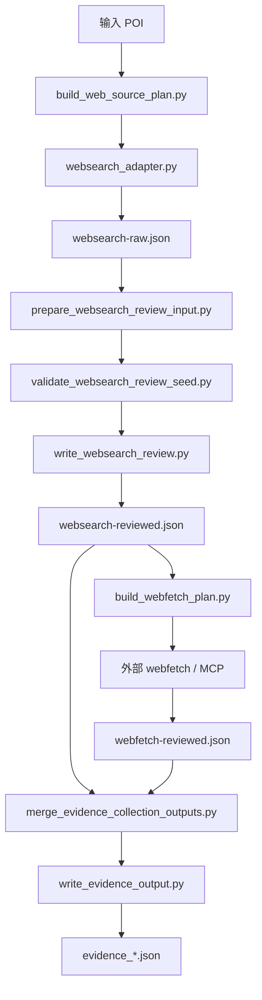
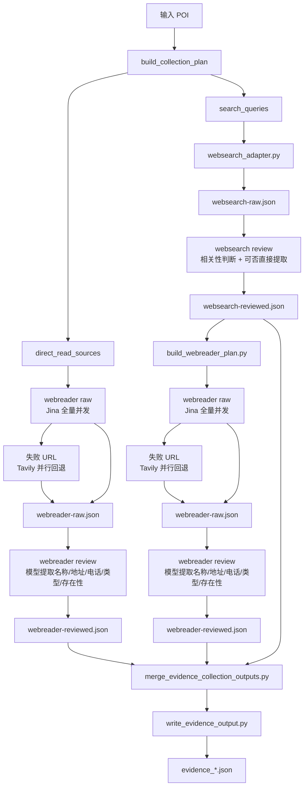

# Product 证据链路改造说明：`webfetch` 替换为 `webreader`

## 1. 文档目标

本文档用于明确当前 `Product/evidence-collection` 中 `websearch`、`webfetch` 与后续拟接入的 `webreader` 的职责边界，并给出一版不改代码前提下的正式改造方案说明。

本文档回答四个问题：

- 当前各功能分别解决什么问题
- 当前正式链路里哪些节点仍然属于 `websearch`
- 当前哪些位置实际上是 `webfetch` 增强层
- 后续应该把哪些位置替换为 `webreader`

## 2. 需求背景

当前证据链路里存在两类不同能力：

1. 按 `query` 进行联网搜索，获取候选网站、标题、摘要和候选 URL。
2. 按指定 `url` 读取页面内容，获取页面正文和更稳定的结构化字段。

本次需求的核心不是替换 `websearch`，而是明确：

- 保留原有 `websearch` 内部代理，继续承担“找候选页面”的职责
- 将当前 `webfetch` 增强层替换为 `webreader` 内部代理，承担“读指定页面”的职责
- 图商链路暂不纳入本次改造范围

本轮新增约束：

- 框架设计上必须适配所有 POI 类型，不能只为政府机关写死
- 迭代优先级上先聚焦政府机关类目
- 对配置文件中已明确的权威网站，应优先 direct read，不再先走 `websearch`
- 政府机关类 `websearch` query 首批只聚焦两个字段：`办公地址`、`联系电话`

## 3. 现状职责划分

### 3.1 `websearch` 的职责

`websearch` 的职责是基于 query 收集候选页面，而不是读取完整页面正文。

当前正式入口：

- `Product/evidence-collection/scripts/build_web_source_plan.py`
- `Product/evidence-collection/scripts/websearch_adapter.py`
- `Product/evidence-collection/scripts/prepare_websearch_review_input.py`
- `Product/evidence-collection/scripts/validate_websearch_review_seed.py`
- `Product/evidence-collection/scripts/write_websearch_review.py`

当前职责边界：

- 输入：POI、类目配置、query、domain、count、time_range
- 输出：`websearch-raw.json`
- 经过 review 后输出：`websearch-reviewed.json`
- 主要用途：找到候选站点、候选页面、标题摘要、可能的页面 URL

`websearch` 不应承担以下职责：

- 读取页面全文
- 解析页面 DOM 或正文块
- 作为单 URL 内容读取器使用

### 3.2 `webfetch` 的职责

当前仓库中的 `webfetch` 不是正式主链路中的独立采集脚本，而是一个“页面增强层”概念。

当前明确存在的正式脚本只有：

- `Product/evidence-collection/scripts/build_webfetch_plan.py`

它的实际职责是：

- 从 `websearch-reviewed.json` 中筛选 `should_fetch=true` 的 item
- 读取 `metadata.fetch_url` 或 `source.source_url`
- 生成待读取 URL 列表

因此，`webfetch` 的真实业务语义不是“继续搜索”，而是：

- 对 `websearch-reviewed` 中已经确认值得保留的结果，按 URL 做页面内容增强读取

### 3.3 `webreader` 的目标职责

后续的 `webreader` 内部代理应承接当前 `webfetch` 的业务位置，但把实现方式从“模型 + MCP 自行处理”替换为“通过内部 API 读取指定 URL 页面”。

目标职责：

- 输入：单个 URL 或 URL 列表
- 输出：页面标题、正文摘要、页面正文与可进入模型提取阶段的原始页面结果
- 用途：补强 `websearch-reviewed` 中不稳定或缺失的字段

强约束补充：

- `webreader` 的原始页面结果不能直接进入 merge
- 原因是页面正文通常冗余严重、噪音多、导航和模板信息占比高
- `webreader` 结果必须先经过模型提取，抽取 POI 关键信息后才能形成 reviewed 结果
- 模型提取的目标至少包括：
  - 名称
  - 地址
  - 类型
  - 电话
  - 存在性信息，如“已变更”“已归并”“已撤销”“迁址”等

### 3.4 `webreader` 内部接口约束

当前已明确的内部接口网关如下：

- 基础地址：`https://10.82.122.209:9081/botshop/proxy/webfetch?url=${url}`
- 方法：`GET`

该网关当前承载两种 provider：

1. `Jina-Reader`

- 参数：
  - `source=jina`
  - `url` 必填
  - `timeout` 可选
  - `referer` 可选
  - `cookie` 可选
  - `user_agent` 可选
- 返回主体位于：
  - `code`
  - `status`
  - `data.title`
  - `data.description`
  - `data.url`
  - `data.content`
  - `data.metadata`
  - `data.external`
  - `data.usage.tokens`

2. `Tavily-Extract`

- 参数：
  - `source=tavily`
  - `url` 必填
  - `timeout` 可选
  - `user_query` 可选
  - `chunks` 可选
- 返回主体位于：
  - `results[]`
  - `results[].url`
  - `results[].title`
  - `results[].raw_content`
  - `results[].images`
  - `failed_results`
  - `response_time`
  - `request_id`

这意味着后续 `webreader` 执行层必须先做 provider 统一适配，再输出统一 reviewed contract，不能把上游 provider 原始结构直接传给 merge。

新增执行约束：

- 对于 `webreader`，默认不采用“逐条 URL 顺序尝试 provider”的方式
- 应采用“两阶段并发”策略：
  1. 先将全部 URL 通过 `Jina` 并行抓取
  2. 仅对 `Jina` 抓取失败的 URL，再通过 `Tavily` 并行回退

这样设计的原因有两点：

- 国内政府机关网站对 `Tavily` 的可达性不稳定，默认不适合作为主通道
- 对全部 URL 先走 `Jina` 并行抓取，整体效率和成功率都会更高

## 4. 当前正式链路分层

忽略图商分支后，当前 web 相关正式链路可以拆成两段：

### 4.1 搜索发现段

链路：

- `build_web_source_plan.py`
- `websearch_adapter.py`
- `prepare_websearch_review_input.py`
- `validate_websearch_review_seed.py`
- `write_websearch_review.py`

产物：

- `web-plan.json`
- `websearch-raw.json`
- `websearch-review-input.json`
- `websearch-reviewed.json`

这段的职责是“发现候选页面 + 做相关性 review”。

### 4.2 页面增强段

链路：

- `build_webfetch_plan.py`
- 外部 `webfetch` 执行步骤
- `webfetch-reviewed.json`
- `merge_evidence_collection_outputs.py`

产物：

- `webfetch-plan.json`
- `webfetch-reviewed.json`

这段的职责是“按 URL 读页面并补强字段”。

## 4.3 当前方案已确认的 review 原则

### `websearch` review

`websearch` 结果必须经过 review，且 review 至少包含两个维度：

1. 页面是否与 query / 目标 POI 相关

- 例如 query 是“南山区人民政府”
- 若页面实际主体是“南山区 xx 街道办事处”或“南山区某下属单位”
- 则必须判定为不相关或弱相关，并在 review 阶段过滤

2. 当前搜索结果是否已经足以直接提取 POI 信息

- 若搜索摘要或页面关键信息已经足以提取 POI 关键字段，则可直接形成 `websearch-reviewed`
- 若信息不足，但页面明显可能包含有效信息，则保留 URL 并交给 `webreader`

### `webreader` review

`webreader` 结果必须经过模型提取 review，目的不是简单判断页面是否可读，而是从页面正文中提取 POI 结构化信息。

review 目标至少包括：

- 提取 POI 名称
- 提取 POI 地址
- 提取 POI 电话
- 提取或修正 POI 类型
- 判断存在性状态
- 判断是否发生变更、归并、迁址、撤销等

因此，`webreader` 的 reviewed 结果本质上应是“页面阅读后的结构化提取结果”，不是页面原文缓存。

## 5. 新的规划原则：`direct_read` + `search_discovery`

后续框架不应再把所有 web 来源统一塞进 `websearch`，而应显式拆成两类来源：

1. `direct_read`

- 适用于配置文件中已明确给出 URL 的权威站点或详情页
- 这些来源应直接进入 `webreader`
- 不必先走 `websearch`

2. `search_discovery`

- 适用于尚未明确具体 URL 的来源
- 这些来源先由 `websearch` 按 query 发现候选页面
- review 通过后，再按需进入 `webreader`

建议新增一条长期原则：

- 已知权威 URL 优先 direct read，未知权威页面再走 search discovery

## 6. 哪些地方应该替换为 `webreader`

结论：应替换的是“页面增强段”，不应替换“搜索发现段”。

### 6.1 应替换项

以下位置建议替换为 `webreader`：

1. `build_webfetch_plan.py`

- 当前语义：生成页面抓取计划
- 建议语义：生成页面读取计划
- 推荐后续名称：`build_webreader_plan.py`

2. `webfetch-reviewed.json`

- 当前语义：页面增强后的 reviewed 结果
- 建议后续名称：`webreader-reviewed.json`

3. `merge_evidence_collection_outputs.py` 的 `-WebFetchPath`

- 当前语义：接收增强层 reviewed 文件
- 建议后续改为：`-WebReaderPath`
- 若考虑兼容过渡期，可暂时同时支持 `-WebFetchPath` 与 `-WebReaderPath`

4. `orchestrate_collection.py` 中的 `-WebFetchPath`

- 当前只是把可选增强层结果透传到 merge
- 后续应改为接 `webreader` reviewed 输出

5. 文档中的 `webfetch` 增强层描述

- `Product/evidence-collection/SKILL.md`
- `Product/README.md`
- `Product/CHANGELOG.md`
- `README.md`
- `CHANGELOG.md`
- `Product/evidence-collection/prompts/webfetch_extract.md`

这些文档后续都应逐步切换为 `webreader` 术语。

6. metadata 来源标识

- 当前约定：`metadata.signal_origin = websearch | webfetch | map_vendor`
- 建议后续改为：`websearch | webreader | map_vendor`

### 6.2 不应替换项

以下位置不应替换为 `webreader`：

1. `websearch_adapter.py`

- 该脚本继续负责通过 query 获取候选网页
- 不应改造成 URL 页面读取器

2. `write_websearch_review.py`

- 该脚本继续负责判断搜索结果是否可保留
- 只需要继续输出 `should_fetch/fetch_url`，作为后续页面读取信号

3. `build_web_source_plan.py`

- 该脚本仍属于搜索计划层，不属于页面读取层

4. 图商相关脚本

- 内部图商代理、图商补采、图商 review 都不属于本次替换范围

5. `write_evidence_output.py`

- 它负责 formal evidence 写盘，只依赖 reviewed 结果结构
- 只要 `webreader-reviewed.json` 仍满足 reviewed generic payload contract，就不需要以替换 `webreader` 为目的重写该脚本

## 7. 推荐改造方案

### 7.1 一阶段：语义收敛

目标：先把术语和边界统一，避免后续实现时混淆 `search` 和 `read page` 两种能力。

建议动作：

- 在文档中明确：
  - `websearch` = 按 query 找候选
  - `webreader` = 按 URL 读页面
- 把当前“`webfetch` 只是增强层”的描述统一改成“后续将由 `webreader` 接管”
- 在主线设计中停止继续扩展 `webfetch` 术语
- 明确 plan 需要支持两种来源：
  - `direct_read_sources`
  - `search_queries`

### 7.2 二阶段：计划层升级

目标：把“所有来源统一走搜索”升级为“直读优先 + 搜索补充”。

建议动作：

1. 升级 `build_web_source_plan.py` 的输出语义

- 不再只输出宽泛的 source 列表
- 需要显式区分：
  - `direct_read_sources`
  - `search_queries`

2. 配置文件中的已知官网、政务公开页、详情页

- 应直接进入 `direct_read_sources`
- 后续由 `webreader` 消费

3. 未知具体 URL 的来源

- 保留在 `search_queries`
- 由 `websearch` 消费

4. query 模板应开始支持按字段建模

- 不再只保留宽泛名称查询
- query 应能表达“我在找什么字段”

补充说明：

- 这里指的不是抽象方向，而是 `build_web_source_plan.py` 后续需要输出更明确的计划数据结构
- 也就是要把“哪个 URL 直接读”“哪个 query 去搜索”“搜索想找什么字段”以结构化字段写进 plan
- 这也是前面提到的“还没定版的输出结构”所指的具体环节

### 7.3 三阶段：`webreader` 执行层接入

目标：把当前“外部 `webfetch` 执行步骤”替换成正式可编排的内部 `webreader` 调用层。

建议动作：

1. 新增统一 `webreader` 调用脚本

- 负责调用内部网关 `botshop/proxy/webfetch`
- 通过 `source=jina` 或 `source=tavily` 选择 provider
- 对 provider 输出做统一适配

2. 统一 provider 归一化输出

建议统一先落 `webreader-raw` 最小字段：

- `source.source_url`
- `source.source_name`
- `source.source_type`
- `metadata.page_title`
- `metadata.text_snippet`
- `metadata.webreader_provider`
- `metadata.webreader_request_url`
- `metadata.webreader_tokens`
- `raw_page.title`
- `raw_page.description`
- `raw_page.content`
- `raw_page.metadata`

然后再通过模型提取生成 `webreader-reviewed`。

3. 默认 provider 选择策略

- `direct_read` 场景：
  - 默认先用 `Jina`
  - 原因：页面正文、标题、描述、metadata 更完整，且对国内政府机关网站可达性更稳定
- `search_discovery` 补强场景：
  - 默认先用 `Jina`
  - 若 `Jina` 抓取失败，再使用 `Tavily` 仅对失败 URL 并行回退
  - 不建议默认把全部 URL 同时发给 `Tavily`

4. provider 调度策略

建议后续正式收敛为“两阶段并发”：

1. 第一阶段：`Jina` 全量并发

- 输入：本批次全部待抓取 URL
- 执行方式：并行抓取
- 输出：成功结果 + 失败 URL 列表

2. 第二阶段：`Tavily` 失败回退并发

- 输入：仅第一阶段失败 URL
- 执行方式：并行抓取
- 可选追加 `user_query`
- 输出：补充成功结果 + 最终失败 URL 列表

推荐原则：

- `Jina` 是主通道
- `Tavily` 是失败回退通道
- `Tavily` 不作为国内政府机关站点的默认主抓取器

5. provider 差异利用策略

- `Jina` 更适合：
  - 已知官网
  - 政务公开页
  - 联系方式页面
  - 需要稳定 `title/description/content/metadata` 的页面
- `Tavily` 更适合：
  - 需要 `user_query` 引导内容重排
  - 需要按“办公地址/联系电话”等目标字段聚焦内容块
  - 页面正文过长，想让 provider 帮忙做更贴意图的抽取

6. 异常处理建议

- 单页读取失败不得阻断主流程
- `webreader` 失败时，仍允许继续使用 `websearch-reviewed`
- 失败信息应落到过程文件，至少包含：
  - `provider`
  - `url`
  - `error_message`
  - `http_status` 或业务 `status`
  - `request_id`（若有）
- 当前暂定以下情况均视为失败：
  - HTTP 请求失败
  - 业务 `code/status` 非成功
  - 页面正文为空
  - 仅返回标题而无有效正文
  - 返回内容明显为拦截页、空白页或无正文模板页

### 7.4 四阶段：政府机关优先试点

目标：框架适配所有类型，但首批只在政府机关类目落精细化策略。

建议动作：

1. 在设计上保持类目无关

- `direct_read_sources` 与 `search_queries` 应作为通用 plan 结构
- 其他类目后续也能按同样方式接入

2. 在配置与 query 模板上先只精细化政府机关

- 首批只针对政府机关增加字段导向型 query
- 其他类目暂时仍可沿用现有较宽泛的 query 方式

3. 政府机关首批 query 只聚焦两个字段

- `办公地址`
- `联系电话`

建议模板示例：

- `<city> <poi_name> 办公地址`
- `<city> <poi_name> 联系电话`

如果配置中已提供明确官网，则优先 direct read，再用上述 query 做补充发现。

### 7.5 五阶段：执行层替换

目标：把当前增强层从 `webfetch` 平滑迁移到 `webreader`。

建议动作：

1. 新增 `webreader` 内部代理执行脚本

- 输入：`webreader-plan.json`
- 输出：`webreader-raw.json` 或直接 `webreader-reviewed.json`

2. 保持 `websearch-reviewed -> 页面增强计划 -> 页面增强结果 -> merge` 的链路形状不变

3. 将 `merge` 的增强层输入从 `WebFetchPath` 迁移为 `WebReaderPath`

4. reviewed contract 继续复用 generic reviewed payload 结构

### 7.6 六阶段：兼容清理

目标：完成正式切换后，逐步清理旧命名。

建议动作：

- 清理文档中的 `webfetch` 术语
- 清理 `webfetch-*` 过程文件命名
- 清理 `signal_origin=webfetch`
- 视兼容期需要，移除 `-WebFetchPath`

## 8. 推荐的最终链路

忽略图商后，建议最终 web 主链路收敛为：

```text
build_collection_plan
-> direct_read_sources
-> webreader
-> webreader_review
-> search_queries
-> websearch_adapter
-> prepare_websearch_review_input
-> validate_websearch_review_seed
-> write_websearch_review
-> build_webreader_plan
-> webreader
-> webreader_review
-> webreader-reviewed
-> merge_evidence_collection_outputs
-> write_evidence_output
```

对应职责：

- `direct_read` 负责“已知权威 URL 直读”
- `websearch` 负责“找页面”
- `webreader` 负责“读页面”
- `webreader_review` 负责“从页面正文提取 POI 结构化信息”
- merge 只认 reviewed 结果

## 8.1 改造前后链路对比

### 改造前



### 改造后



## 9. `webreader` 接口接入建议

基于当前已知接口协议，建议后续执行层采用以下方式接入：

### 9.1 请求层

- 统一使用内部网关：
  - `GET https://10.82.122.209:9081/botshop/proxy/webfetch?url=${url}`
- 通过 `source` 参数切换 provider：
  - `source=jina`
  - `source=tavily`

### 9.2 provider 适配层

建议在执行脚本中统一做两层适配：

1. 原始响应适配

- `Jina`：
  - 从 `data.title/data.description/data.content/data.metadata` 中抽取
- `Tavily`：
  - 从 `results[0].title/results[0].raw_content` 中抽取

2. reviewed 合同适配

- 不把 provider 的原始 JSON 直接暴露给 merge
- 先转成统一的 `webreader-raw` payload
- 再通过模型提取转成 `webreader-reviewed` payload

### 9.2.1 `websearch` review 输出建议

不建议把 `websearch review` 收缩成只有 `url + 是否相关`。

更稳妥的建议是保留以下最小字段：

- `result_id`
- `source_url`
- `is_relevant`
- `entity_relation`
- `reason`
- `can_extract_directly`
- `extracted`
- `should_read`
- `read_url`

原因：

1. 如果只保留 `url + 是否相关`

- 就无法区分“相关但当前摘要已足够提取”与“相关但必须继续读页面”这两类情况
- 也无法保留最小结构化提取结果

2. `websearch review` 其实承担两个决策

- 页面是否相关
- 当前是否已经足以直接形成 evidence-like 提取结果

因此建议：

- `websearch-reviewed` 继续保留 evidence-like item
- 额外保留 `should_read/read_url`
- 后续 `build_webreader_plan.py` 再只从 `should_read=true` 的 item 中构造待读取 URL

### 9.3 provider 选择建议

- 已知官网、政务公开页、联系方式页：
  - 默认 `Jina`
- 批量抓取阶段：
  - 默认所有 URL 先走 `Jina` 并行抓取
- `Jina` 失败 URL：
  - 再交由 `Tavily` 并行回退
- 需要围绕用户意图聚焦内容块时：
  - 对失败回退或特定增强场景使用 `Tavily` 并带 `user_query`

### 9.4 政府机关场景下的 `user_query` 建议

对于政府机关类目，若后续启用 `Tavily`，建议首批只围绕以下 intent：

- `请提取该机构的办公地址`
- `请提取该机构的联系电话`

## 10. 政府机关场景的近期实现建议

为了避免一次性铺太大，建议近期迭代先按以下范围收口：

1. 框架层先做通用设计

- plan 结构支持所有类型共用的 `direct_read_sources` / `search_queries`

2. 配置层先打政府机关

- 只在政府机关类目中补充 `direct_read` 来源与字段导向型 query 模板

3. query 首批只做两个字段

- `办公地址`
- `联系电话`

4. 不做的事

- 暂不同时为所有类目设计精细化 query 模板
- 暂不扩展到办公时间、职责介绍、机构设置等更多字段
- 暂不改图商线

## 11. 当前文档结论

本次需求下，正式应替换为 `webreader` 的位置是当前所有 `webfetch` 增强层节点，而不是 `websearch` 搜索节点。

可以用一句话概括：

- `websearch` 保留
- `webfetch` 替换为 `webreader`
- 已知官网 direct read，未知页面再 search discovery
- 框架适配所有类型，首批重点先做政府机关
- 政府机关 query 首批只聚焦 `办公地址` 与 `联系电话`
- `webreader` 执行层走内部网关，采用“两阶段并发”：先 `Jina` 全量并行抓取，再仅对失败 URL 走 `Tavily` 并行回退
- `websearch` 与 `webreader` 结果都需要 review，其中 `webreader` review 负责从页面正文提取 POI 结构化信息

## 12. 后续实施建议

后续代码改造前，建议先按本文档确认以下三个技术决策：

1. `webreader` 保留 `raw -> review -> reviewed` 两段
2. `merge` 是否采用双参兼容：`WebFetchPath` 与 `WebReaderPath`
3. `should_fetch/fetch_url` 是否同步更名为 `should_read/read_url`

同时建议补充确认两点产品决策：

4. `build_web_source_plan.py` 是原地升级，还是升级为更通用的 `build_collection_plan.py`
5. 政府机关类配置中，哪些官网 URL 进入 `direct_read_sources`，哪些仍保留为 `search_queries`
6. `webreader` 执行层是否采用：
   - `Jina` 全量并发主通道
   - `Tavily` 仅对失败 URL 的并发回退通道
7. `websearch-reviewed` 是否保留当前命名，还是统一改成更中性的 reviewed contract 命名

若以上三点达成一致，再进入脚本改造阶段，实施成本会明显更低。

## 13. 已落地的数据交换规格（2026-04-07）

以下规格对应当前仓库已实现脚本，作为联调基线。

### 13.1 `build_web_source_plan.py` 输出（`web-plan.json`）

核心新增字段：

- `direct_read_sources[]`
  - `source_name`
  - `source_type`
  - `source_url`
  - `target_poi_name`
  - `target_city`
  - `target_poi_type`
  - `weight`
  - `mode=direct_read`
  - `read_intents`（政府机关默认：`办公地址`、`联系电话`）
- `search_queries[]`
  - `query_id`
  - `query`
  - `query_intent`（政府机关默认：`office_address` / `contact_phone`）
  - `domain`
  - `count`
  - `time_range`
  - `source_name/source_type/source_url`
  - `mode=search_discovery`

兼容字段保留：

- `official_sources[]`
- `internet_sources[]`

### 13.2 `write_websearch_review.py` 输出（`websearch-reviewed.json`）

当前增强信号字段已升级为：

- `metadata.should_read`（主字段）
- `metadata.read_url`（主字段）

兼容字段仍保留：

- `metadata.should_fetch`
- `metadata.fetch_url`

### 13.3 `build_webreader_plan.py` 输出（`webreader-plan.json`）

- `read_targets[]`
  - `read_id`
  - `source_url`
  - `source_name`
  - `source_type`
  - `read_reason`（`direct_read` / `search_followup`）
  - `read_intents`
  - `enhances_result_id`（来自 `websearch-reviewed`）
- `fallback_policy=websearch_reviewed_can_continue_when_webreader_missing_or_failed`

输入来源：

- `direct_read_sources`（来自 `web-plan.json`）
- `should_read=true` 的 `websearch-reviewed` 项

### 13.4 `webreader_adapter.py` 输出（`webreader-raw.json`）

执行策略已落地：

1. `Jina` 全量并发
2. 对失败 URL 以 `Tavily` 并发回退

输出结构：

- `items[]`（仅成功项）
  - `read_id`
  - `source`（`source_id/source_name/source_type/source_url/weight`）
  - `metadata`
    - `signal_origin=webreader_raw`
    - `webreader_provider`
    - `webreader_request_url`
    - `webreader_tokens`（若有）
    - `read_reason`
    - `read_intents`
    - `enhances_result_id`
    - `source_domain`
    - `page_title`
    - `text_snippet`
  - `raw_page`
    - `url`
    - `title`
    - `description`
    - `content`
    - `metadata`
    - `external`
  - `status=ok`
- `failed_items[]`（失败项，包含 `error_message` 与 provider 信息）
- `provider_attempts[]`（两阶段尝试轨迹）

### 13.5 `prepare/validate/write_webreader_review` 合同

#### `prepare_webreader_review_input.py`

输出 `webreader-review-input.json`：

- `review_items[]`
  - `result_id=WR_xxx`
  - `source`
  - `candidate.provider/page_title/page_description/content_excerpt/read_reason/read_intents/enhances_result_id`

#### `validate_webreader_review_seed.py`

要求 seed `items[]` 覆盖全部 `result_id`，并校验：

- `result_id`
- `is_relevant`（bool）
- `reason`
- `confidence`（0~1）
- `source_type`
- `existence_status`（可选，枚举：`active/changed/merged/revoked/unknown`）
- `extracted`（对象；若 `is_relevant=true`，`extracted.name` 必填）

#### `write_webreader_review.py`

输出 `webreader-reviewed.json`：

- `items[]`（generic reviewed payload，可直接供 merge）
  - `source`
  - `data`（名称、地址、电话、类型等提取结果）
  - `verification.confidence`
  - `metadata.signal_origin=webreader`
  - `metadata.existence_status`
  - `metadata.webreader_provider`
  - `metadata.result_id`

### 13.6 主控与归并参数兼容

#### `orchestrate_collection.py`

新增参数：

- `-WebReaderPath`（外部传入 reviewed）
- `-WebReaderReviewSeedPath`（内置 webreader review 所需 seed）

兼容参数：

- `-WebFetchPath`（兼容旧调用，内部等价为 webreader reviewed 输入）

#### `merge_evidence_collection_outputs.py`

新增参数：

- `-WebReaderPath`

兼容参数：

- `-WebFetchPath`（仅兼容过渡；内部统一按 `webreader` 分支归并）
